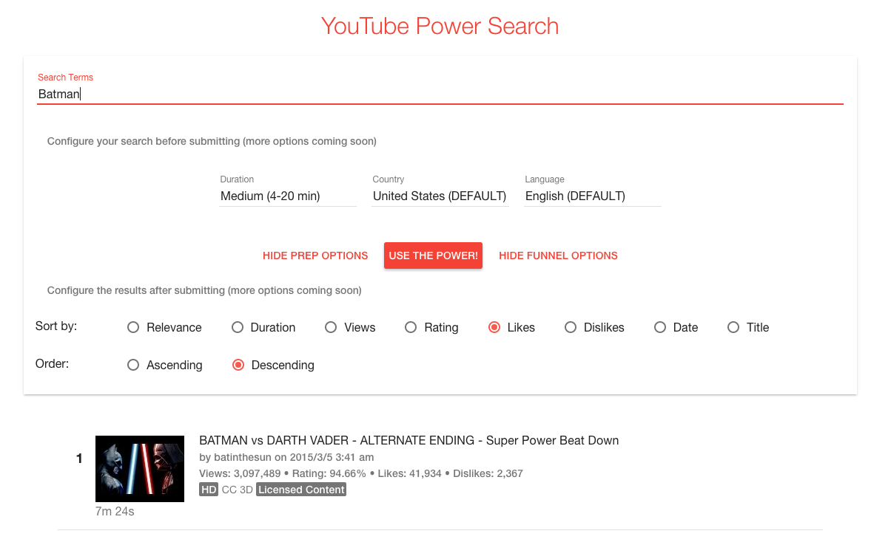

#  YouTube Power Search

*Work in progress. [Prototype is **DEPLOYED**](https://youtubepowersearch.firebaseapp.com/), but just starting to become useful. Please hold your breath accordingly.*

A more advanced search tool for finding YouTube content. Feel the power! ...once I've actually completed some features.

<!-- START doctoc generated TOC please keep comment here to allow auto update -->
<!-- DON'T EDIT THIS SECTION, INSTEAD RE-RUN doctoc TO UPDATE -->
**Table of Contents**  *generated with [DocToc](https://github.com/thlorenz/doctoc)*

- [Screenshots](#screenshots)
- [Development](#development)
  - [Tech](#tech)
  - [Challenges](#challenges)
  - [Credits](#credits)

<!-- END doctoc generated TOC please keep comment here to allow auto update -->

## Screenshots

*Work in progress*

## Development

### Tech

- AngularJS w/ Angular Material
- Google API JavaScript Client
- Karma w/ Jasmine
- Gulp
- CircleCI
- Firebase Hosting

### Challenges

- **Problem:** Using Google's API JavaScript Client Library with AngularJS is surprisingly *not* straightforward. **Solution:** The Google API Client (GAPI) has some sort of async loading going on. Waiting for that to finish before the Angular app starts using it was a bit tricky, but I ended up using a promise-based solution after being unsatisfied by both (1) the most relevant [SO answer I could find](http://stackoverflow.com/questions/19399419/angular-js-and-google-api-client-js-gapi) and (2) [Google's own recommendation](https://cloud.google.com/solutions/angularjs-cloud-endpoints-recipe-for-building-modern-web-applications)

- **Problem:** Angular Material isn't the most stable library ever. ¯&#92;&#95;(ツ)&#95;/¯ **Solution:** Remind myself to open some pull requests later.

### Credits
- Creator: [RebootJeff](https://twitter.com/RebootJeff)
- Superman vs Batman w/Trampoline gif by: Unknown :pensive:
